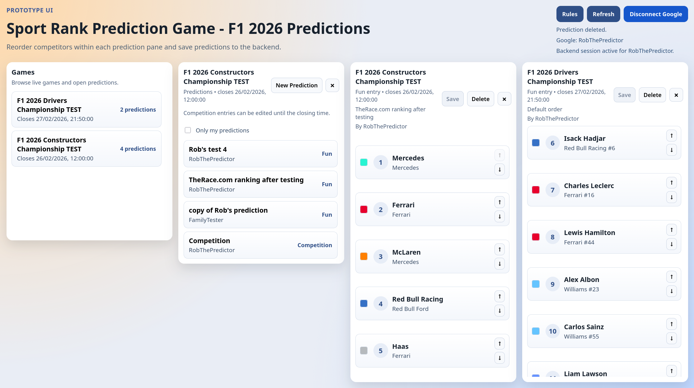

# Sport Rank Prediction Game

Sport Rank Prediction Game is a web app for creating and sharing ranked predictions for
sports competitions. The initial focus is Formula 1 2026, but the model supports any game
with a list of competitors and a closing date.

## How the game works

- Admins create games and competitor lists.
- Users create predictions by ordering the competitors.
- Each game allows one competition prediction per user (editable until the game closes)
  plus any number of fun predictions for experimenting.
- Scoring is lowest-score-wins: each competitor earns points equal to the difference
  between predicted and actual finishing position (0 for perfect, 1 if off by one, etc.).
- Scores will appear once results are available (to be implemented later).

## Deployment strategy

The app is deployed to AWS with CDK:

- Backend: API Gateway + Lambda + DynamoDB for sessions, users, games, competitor lists,
  and predictions.
- Frontend: Vite build assets hosted on S3 and served via CloudFront.
- Environment configuration uses `.env.local` for OAuth and CORS settings, and CDK
  scripts deploy backend, frontend, or both.

For step-by-step setup and deployment commands, see `INSTALL.md`.
